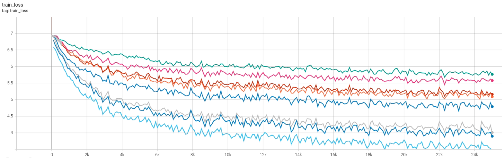

#  AutoML

The goal of this repository is to create an end-to-end ML pipeline that allows users to:

- Easily retrain and train vision models (classification task for now) that can match SOTA results.
- Easily evaluate and test trained models.
- Search for the most suitable model within the constraint set by the user in relation to inference speed, memory requirement, accelerator type and performance.
- Ensure that deployed model can be continuously improve upon new requirements and data automatically.
- Collaborate with others as the pipeline is fully reproducible and experiments are well tracked.


# Structure

In this repository, we are using [hydra](https://hydra.cc/) for configuration management.

```
├── configuration
│   ├── callback                 <- Callbacks configs
│   ├── datamodule               <- Datamodule configs
│   ├── logger                   <- Logger configs
│   ├── models                   <- Model configs
│   ├── optimizers               <- Optimizers config
│   ├── schedulers               <- Scheduler config
│   ├── trainer                  <- Trainer configs
|   ├── tester                   <- Tester configs
│   |
│   ├── configs.yaml             <- Main config
```

Everything that can/need to be tune/configure should be in configuration files. After the training ends, we will save a full configuration file together with the logs and model weights. *The goal will be to allow full reproducibility from a single configuration file (...in works).*

```
├── configuration
├── datamodule
├── examples
├── serving
├── utils
```

....further explain in the future once we have confirmed the repository structure.


## Training


To ensure ease of training, everything that is necessary for training is configurable under the `configuration` folder.

One of the goal of this repo is to allow for automatic training, where the handling of the selection of optimisers, schedulers and all hyperparameters are done for the users.

#### Automatic Optimizer Search

Refer to `configuration/optimizers` folder for the optimiser configuration file, you will see that one of the selection allowed in `opt` is `auto`. By setting `opt: auto`, we will run all optimizers for a user defined amount of steps/epochs/time (`max_step_count`, `max_training_time`, `num_epochs`). The optimizer that gives the lowest loss value will be selected for further training till the end of training as defined by the user.

**Note: `auto` option only works for 1 GPU set up for now**

If usage of multiple GPUs is wanted, manually use the bash script instead and change the argument accordingly as seen in `examples/optimisers_check.sh`.



#### Hyperparameters Tuning

ASHA (Asynchronous Successive Halving Algorithm) is used to scehedule the training of different sets of hyperparameters to maximize hardware efficiency. Bayesian Optimization is used to search for new sets of hyperparameters based on past knowledge. The implementation is done via the ray[tune] library.

[Reference 1](https://arxiv.org/pdf/1810.05934.pdf) | [Reference 2](https://docs.ray.io/en/releases-1.4.1/tune/index.html)


#### Retraining

Resuming or retraining models can be done via the main configuration `configuration/configs.yaml`.

```
resume_full_training: false  # resume training with all states intact.
resume_weights_training: false # used if you only want to resume from the weights of the model but keep all the other states according to config.
```
If you resume full training, it means that it will continue with all the hyperparameters where the model previously stopped training; this can only be done if you have enable checkpoint callback and switch on `save_last_model` under `configuration/callback`. If you are very sure that you only want to continue with the model weights and reconfigure all hyperparameters for retraining, then you can just on `save_weights_only`. `save_last_model` and `resume_weights_training` will also work as `resume_weights_training` will allow overriding of all hyperparameters.

#### Callback Visualization
Callback visualization refers to the insights obtained during a validation callback, which includes the Confusion Matrix, images that the model failed to predict correctly, the accuracy of the model in each class, flaggin mislabelled images, etc. The callback can be trigerred by setting `do_not_visualize_round` to 0 at `configuration/callback`. The flagging of mislabelled images is done throught a heuristic that are discussed more in depth in `docs/data_qc_report.pdf`.


#### Sample Usage

1. Training with optimizer search
    ```
    python train.py trainer.tune=False trainer.devices=1 optimizers.option=auto
    ```
2. Tuning with optimizer search
    ```
    python train.py trainer.tune=True trainer.devices=1 optimizers.option=auto
    ```

## Testing and Evaluation
To ensure ease of testing, everything that is necessary for testing is configurable under the `configuration/tester` folder. The user is required to fill up the test set's path. By default, architecture and checkpoint will be set to auto which will extract model information from the `configuration/models` and pre-trained weight from timm.

## Weigthed Sampling in Dataloader
A weighted sampling can be applied to our dataset by setting `weighted_sampling` to 1 in `configuration/datamodule`. This is helpful when there is a large distribution skew in the dataset. Below shows the effect of weighted sampling where the right side is a dataloader with weighted sampling turned on.


#### Sample Usage

1. Testing optimized model for accuracy and inference speed
    ```
    python test.py tester.trt_opt=True tester.measure_speed=True
    ```

## Benchmarking & Model Search

`benchmarking.py` aims to allow user to benchmark inference speed of all timm models.

**Future works: Auto selection of model (model search) given user constraint**

#### Sample Usage

1. Benchmarking for all timm models and saving the csv file to a specific location
    ```
    python benchmark.py --file-location "./results/all_models.csv"
    ```
2. Benchmarking for timm models under the resnet family and not running TensorRT conversion.
    ```
    python benchmark.py --find-specific-models --specific-model-family resnet  --off-tensorrt
    ```

Run `python benchmark.py --help` to see more usage options.
The benchmark output can be found under the results folder.

## Reproducibility
By using hydra for configurations, we are able to achieve full reproducibility on our trained models. This can be done by retrieving the `full_configurations.yaml` file from the logs folder. If hyperparameters tuning is used, first convert the `params.json` file to `params.yaml` using json_to_yaml() from utils/support.py. After that, move the yaml file to `configurations/` and rename it to `configs.yaml`.


## Dependencies


1. Install dependencies

    Start a virtual environment:
    ```
    conda create -n backbones python=3.8
    ```

    External library requirements that are **functional**:
    ```
    pip install -r requirements.txt
    ```

    External library requirements that are **non-functional**:
    ```
    pip install -r style_requirements.txt
    ```

2. Install pre-commits on local PC

    ```
    pip install pre-commit
    cd xxx/vision_backbones
    pre-commit install
    ```
3. Install torch2trt in order to run inference for optimized models, for more information, refer to [torch2trt](https://github.com/NVIDIA-AI-IOT/torch2trt).
    ```
    git clone https://github.com/NVIDIA-AI-IOT/torch2trt
    cd torch2trt
    python setup.py install
    ```

It is recommended that you read this requirement files to understand external libraries we are leveraging on. For `style_requirements`, recommended that you integrate the IDE/editor in use with the format/style checks or else you may fail the pre-commit checks.

## Contact
- Name: Chau Yuan Qi
- Email: yuanqichau@gmail.com
